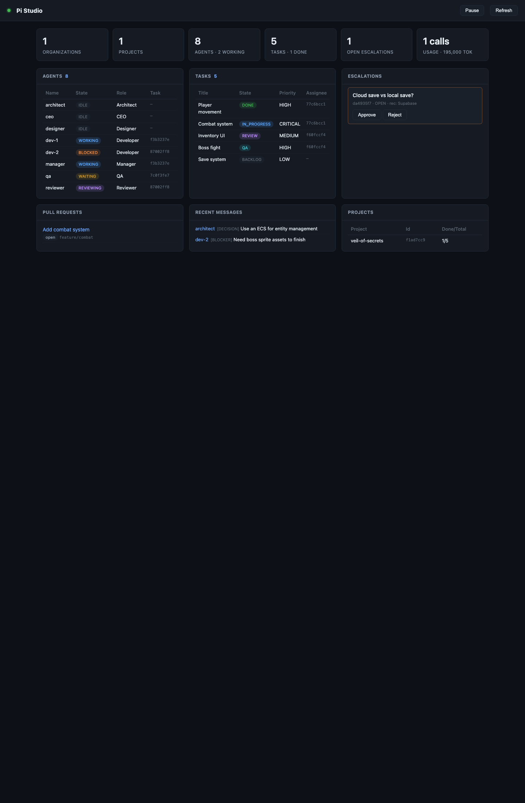

# Pi Guild

> **Turn Pi into an autonomous multi-agent software-development organization.**

Pi Guild is a TypeScript extension package for the [Pi coding agent] that models
your work the way a small software company does: a configurable hierarchy of AI
agents (CEO → managers → workers), persistent local state, event-driven
coordination, and dependency-gated task scheduling. **Pi remains the runtime** —
there is no external daemon, no parallel agent runtime, and no separate
dashboard that matters. Everything runs inside Pi, and every durable fact lives
in a local SQLite database.

Pi Guild is **local-first** and **offline by default**. Agents run with full
system permissions (see [Security](#security-model)); treat the workspace and
model providers you grant as trusted boundaries.

```
      ▄▄▄▄▄▄▄▄▄▄▄▄▄▄▄▄▄▄▄▄▄▄▄▄▄▄▄▄▄▄▄▄▄
      █  ╔══════════════════════╗        █
      █  ║   ✦  PI GUILD  ✦   ║        █
      █  ╚══════════════════════╝        █
      █        _________________         █
      █       /                 \        █
      █      /   ╔═══════════╗   \       █
      █     |    ║  GUILD    ║    |      █
      █     |    ║  HALL     ║    |      █
      █     |    ╚═══════════╝    |      █
      █     |     ___________     |      █
      █     |    |  ★  ★  ★  |    |      █
      █     |    |___________|    |      █
      █      \_________________/        █
      █       |   |   |   |   |         █
      █       |   |   |   |   |         █
      ▀▀▀▀▀▀▀▀▀▀▀▀▀▀▀▀▀▀▀▀▀▀▀▀▀▀▀▀▀▀▀▀▀
```

Welcome to the guild. The Craftmaster (CEO), the Stewards (managers), and the
Journeymen (developers, reviewers, QA, designers) all work here — and the
foreman is always in.

---

## Features

- **Guided autonomous runs** — `/guild` asks what to build, then plans and runs
  the whole team through to `DONE` — no manual spawning or assigning.
- **Nine data-driven roles** — CEO, Manager, Architect, Developer, Reviewer, QA,
  Researcher, Designer, Librarian — editable without touching code.
- **Dependency-gated scheduler** — tasks only run when their dependencies are
  done; cycle detection rejects invalid graphs; design-labeled tasks route to a
  Designer.
- **Review → QA pipeline** — dev → review → QA with a configurable approval
  policy, and **auto-merge** of PRs (unless `manual_merge`).
- **Git workflow** — branches, commits, push, PRs, and merges with
  protected-branch defaults, behind one `RepositoryProvider` abstraction
  (local git + GitHub).
- **Model routing** — assign models per role or per model class, auto-assign
  from whatever's logged in on the harness, or preset to one provider
  (e.g. OpenCode Go).
- **Council (multi-model synthesis)** — run one question through several models
  and reconcile a consensus.
- **Skills & context assembly** — per-role `SKILL.md` injection, plus a context
  assembler that gathers relevant memory, decisions, and prior attempts into
  each agent's prompt.
- **Background workers** — fire-and-forget jobs via `/guild bg`, and an
  explicitly-started background scheduler (`/guild start`).
- **Live TUI panel + browser dashboard** — watch the agent roster in the TUI or
  in a local web dashboard.
- **Recovery & budgets** — restart reconciliation, plus token/call/time limits
  with `continue` / `pause` / `escalate`.
- **Optional Plane adapter** — mirror projects/tasks into a Plane workspace.
- **Persistent & auditable** — everything in local SQLite, with an audit log.

---

## Architecture

```
                        Pi (runtime)
                            │
                   ┌────────┴─────────────────────────┐
                   │   Pi Guild extension (pi/)      │   ← /guild commands, guild_* tools
                   │                                  │
                   │   ┌──────────────────────────┐   │
                   │   │  Core engine (core/)     │   │
                   │   │  org · projects · agents │   │
                   │   │  tasks · messaging ·     │   │
                   │   │  policies · memory ·     │   │
                   │   │  orchestration · events  │   │
                   │   └──────────┬───────────────┘   │
                   │              │                    │
                   │   ┌──────────▼───────────────┐   │
                   │   │  SQLite (database/)       │   │  ← local source of truth
                   │   └──────────────────────────┘   │
                   │                                  │
                   │   ┌──────────────────────────┐   │
                   │   │  Integrations (opt-in)   │   │
                   │   │  git · github · plane    │   │
                   │   └──────────────────────────┘   │
                   └──────────────────────────────────┘
```

| Layer | Directory | Role |
|-------|-----------|------|
| Pi adapter | `pi/` | extension entry, `/guild` commands, `guild_*` tools, TUI |
| Core engine | `core/` | domain services, orchestration, scheduler, event bus |
| Persistence | `database/` | SQLite schema, migrations, `GuildRepository` |
| Agent definitions | `agents/` | data-driven role files (`role.md`, `policy.json`, `tools.json`, `prompt.md`, `skills.json`) |
| Skills | `skills/` | `SKILL.md` files injected into role prompts |
| Integrations | `integrations/` | git / github / plane adapters (all optional) |
| UI | `ui/` | the optional browser dashboard |

**Runtime model.** Each agent is a genuine in-process agent loop created with
Pi's SDK `createAgentSession()` — its own `cwd` (project workspace), `model`,
`tools`, and `SessionManager`. Multiple sessions can run concurrently; the
scheduler decides *which* run, *when*, and *why*. There are no persistent
manager processes: management runs in ephemeral sessions triggered by events.
Each agent receives **only the tools its role allows** (a Reviewer cannot edit
code; a Developer gets the git workflow).

**No background daemon.** Nothing is started from the extension factory. The
background scheduler is an explicit, started component — `/guild start` spawns
a bounded loop that continuously runs ready work across projects, and
`/guild stop` (or `session_shutdown`) tears it down.

---

## Installation

Requires **Node ≥ 22.5** (for the built-in `node:sqlite`). Install the package
from npm:

```bash
pi install npm:pi-guild
```

For local development, install straight from a checkout:

```bash
git clone <your-fork> pi-guild && cd pi-guild
npm install
pi install .            # local-path install; reloads pick up source changes
```

There are no native modules and no runtime dependencies beyond Pi's own peer
packages. The database is `node:sqlite`, part of the Node standard library.

---

## First-run walkthrough

**1. Set up the organization and models**

```text
/guild setup
```

This creates the local database at `~/.pi/agent/pi-guild/guild.db`, seeds the
nine agent roles and the default policy set, then asks how you want to route
models:

- **Auto-assign from logged-in models** (recommended) — reads what the harness
  reports as authenticated and assigns all five model classes.
- **Choose per class** — walks you through five pickers (reasoning, cheap
  reasoning, coding, cheap coding, research).
- **Skip** — assign later with `/guild models`.

Skip nothing — model routing takes a minute and decides the whole team's cost
and quality profile (see [Model routing](#model-routing)).

**2. Run a job**

```text
/guild
```

Answer the prompts: what to build, the project name, and the approval policy.
Pi Guild then:

1. Creates the organization/project/goal.
2. Initializes a local git repository in the project workspace.
3. Spawns a **Manager** agent that decomposes the goal into tasks via the
   `guild_*` tools (falling back to a deterministic plan if the model yields
   nothing).
4. Runs the dependency-gated loop: **Developers** implement (branch + commit
   locally) → **Reviewer** approves/requests changes → **QA** passes/fails →
   `DONE`, merging the PR automatically unless you chose `manual_merge`.

Progress streams as TUI notifications. Hold it with `/guild pause`, resume
with `/guild resume`, inspect with `/guild status` / `/guild agents` /
`/guild tasks`.

**3. Watch it work**

```text
/guild live                          # live agent panel in the TUI
/guild dashboard                     # browser dashboard at http://127.0.0.1:<port>
```

The dashboard auto-refreshes every 2 seconds and lets you pause/resume and
approve/reject escalations from the browser.

**4. Wire up real infrastructure (optional)**

```text
/guild git setup <project> github https://github.com/you/repo   # push + PRs
/guild plane setup <base-url> <workspace-slug> <api-key>        # Plane mirror
/guild plane sync <project-id>
/guild github <project-id>                                      # PR/CI status
```

Everything works without these — they're mirrors on top of the local source of
truth.

---

## What it looks like

**The live TUI panel** (`/guild live`) — org/project/task counts plus the agent
roster, updated live during runs:

```text
Pi Guild — live
orgs=1 projects=1 paused=false
tasks: DONE=1 IN_PROGRESS=1 REVIEW=1 QA=1 BACKLOG=1

name       role       state      id
architect  Architect  IDLE       6e5a5e1d
ceo        CEO        IDLE       2757689e
designer   Designer   IDLE       1fd1eb2b
dev-1      Developer  WORKING    97002811
dev-2      Developer  BLOCKED    4322226c
manager    Manager    WORKING    93985055
qa         QA         WAITING    a6877c1b
reviewer   Reviewer   REVIEWING  a4106543
```

**The browser dashboard** (`/guild dashboard`) — the same state in a live,
auto-refreshing web view with color-coded statuses, escalation approve/reject,
and per-project progress:



**Command output** is aligned and id-truncated. A team mid-run looks like this:

```text
/guild agents

name       role       state      id
architect  Architect  IDLE       6e5a5e1d
ceo        CEO        IDLE       2757689e
dev-1      Developer  WORKING    97002811
dev-2      Developer  BLOCKED    4322226c
manager    Manager    WORKING    93985055
reviewer   Reviewer   REVIEWING  a4106543
qa         QA         WAITING    a6877c1b

/guild tasks

state        title            assignee    id
DONE         Player movement  97002811    763e1486
IN_PROGRESS  Combat system    97002811    55489cde
REVIEW       Inventory UI     4322226c    d0e47b2b
QA           Boss fight       4322226c    4ceadd68
BACKLOG      Save system      (unassigned)  7a4cbb98

/guild models

  reasoning        -> anthropic/claude-sonnet-4-5
  cheap reasoning  -> opencode-go/deepseek-v4-pro
  coding           -> opencode-go/deepseek-v4-pro
  cheap coding     -> opencode-go/deepseek-v4-pro
  research         -> opencode-go/deepseek-v4-pro
```

These examples were generated from the real formatting code against demo data
(see `seed-demo.ts`); regenerate them with `npx tsx demo-output.ts`.

## Model routing

Models are assigned per **model class** — `reasoning`, `cheap-reasoning`,
`coding`, `cheap-coding`, `research` — so five choices cover every role, with
per-role overrides on top. No vendor names are hardcoded.

```text
/guild models list                  # what's logged in on the harness
/guild models providers             # which providers have models
/guild models auto                  # best-effort auto-assign all classes
/guild models preset opencode-go    # auto-assign using only one provider
/guild models class coding opencode-go/deepseek-v4-pro
/guild models set Developer anthropic/claude-sonnet-4-5   # per-role override
/guild models clear                 # reset routing
/guild models                       # show current assignments
```

Auto-assign reads the models the harness reports as logged in
(`ctx.modelRegistry.getAvailable()`) and prefers capability hints — `opus` /
`sonnet` / `o3` / `o4` → reasoning, `code` / `claude` / `gpt` / `deepseek` →
coding, `haiku` / `mini` / `flash` / `deepseek` → cheap classes. The runner
resolves assigned models through Pi's `ModelRuntime`, so custom providers (like
`opencode-go` from `models.json`) work, not just the static catalog.

## Commands

All commands live under the `/guild` namespace:

| Command | Purpose |
|---------|---------|
| `/guild` / `run` | guided wizard: plan + run a job autonomously |
| `/guild setup` | wizard: create DB, seed roles + policies, configure model routing |
| `/guild status` | org/project/agent/task counts + pause flag |
| `/guild org` / `org create <name>` / `org use <id>` | list / create / select organizations |
| `/guild projects` / `projects create <name>` | list / create projects in the current org |
| `/guild agents` / `agents spawn <role>` / `agents stop <id>` | list / spawn / stop agents |
| `/guild tasks` / `tasks create <project> <title>` / `tasks assign <taskId> <agentId>` | list / create / assign tasks |
| `/guild messages` / `messages send <recipient> <text>` | list / send messages |
| `/guild goals` / `goals create <title>` | list / create goals |
| `/guild policies` | list policies |
| `/guild escalate` / `approve <id>` / `reject <id>` | create / resolve human escalations |
| `/guild pause` / `resume` | pause / resume the scheduler |
| `/guild recover` | reset orphaned agents/tasks (also runs on start) |
| `/guild stop <agentId>` / `stop project <id>` / `stop` | stop an agent, a project's agents, or the background scheduler |
| `/guild council [question]` / `members` / `add <provider>/<model>` / `reset` | multi-model synthesis |
| `/guild bg <role> <prompt>` | fire-and-forget background job |
| `/guild live` | refresh the live agent panel |
| `/guild start` | start the background scheduler loop |
| `/guild git setup <project> local <path>` / `github <url>` | register a repository |
| `/guild git branch` / `commit` / `push` / `pr` / `merge` / `log <taskId>` | the git workflow |
| `/guild plane setup <baseUrl> <slug> <apiKey>` / `status` / `sync [projectId]` / `comments <taskId>` | Plane mirror |
| `/guild github [projectId]` | PR / CI status via `gh` |
| `/guild config [get <key>` / `set <key> <value>` / `setjson <key> <json>]` | read/write settings |
| `/guild usage [projectId]` | token/call/time usage |
| `/guild models [list` / `providers` / `auto` / `preset <provider>` / `set` / `class` / `clear]` | model routing |
| `/guild dashboard [status` / `stop]` | start/stop the browser dashboard |
| `/guild doctor` | DB path, counts, integrations, settings |
| `/guild logs [N]` | last N audit entries |

The same surface is available to agents as **34 `guild_*` tools**
(`guild_list_tasks`, `guild_create_task`, `guild_decompose_task`,
`guild_add_task_dependency`, `guild_send_message`, `guild_record_decision`,
`guild_report_verdict`, `guild_git_*`, `guild_council`,
`guild_escalate_to_human`, …).

## Agent roles

Nine data-driven roles ship in `agents/` (each with `role.md`, `policy.json`,
`tools.json`, `prompt.md`, and optionally `skills.json`):

| Role | Responsibilities | Notable permissions |
|------|------------------|---------------------|
| **CEO** | strategy, goals, priorities, budget, escalation | read-only + strategy; never writes code |
| **Manager** | decompose goals into tasks, assign, monitor, escalate | create/decompose/assign tasks |
| **Architect** | system design, technical decisions, task breakdowns | design + create tasks |
| **Developer** | implement code, write tests, fix bugs | edit code, run bash, git workflow |
| **Reviewer** | review code against acceptance criteria | read + approve/request changes; never edits code |
| **QA** | write/run tests, report bugs, verify fixes | run tests, write tests, report bugs |
| **Researcher** | investigate unknowns, produce sourced findings | read + search the web |
| **Designer** | UI/UX: layout, typography, color, motion; produces working markup/styles | edit code, create branches |
| **Librarian** | find authoritative answers from docs/GitHub/web, with sources | read-only + web search |

Roles are **data-driven**: edit the files in `agents/<role>/` to change a role's
tools, permissions, or system prompt without touching code. `seedRoles()` is
idempotent and falls back to built-in defaults when files are missing. The
runner **enforces** each role's tool list at session build time.

## Git workflow

Developer agents create branches, commit, push, and open pull requests via the
`guild_git_*` tools (or `/guild git ...`), with protected-branch defaults
(`main`/`master`) and branch naming (`feature/<taskId>-<slug>`, `bugfix/`,
`refactor/`). Local git and GitHub (`gh` CLI) sit behind one
`RepositoryProvider` abstraction — GitLab/Gitea/Forgejo slot in behind the same
interface.

```text
/guild git setup <project> github https://github.com/you/repo
/guild git branch <taskId>      # create feature/<taskId>-<slug>
/guild git commit <taskId> "Implement X"
/guild git push <taskId>
/guild git pr <taskId>          # open a pull request
/guild git merge <taskId>       # merge the PR (auto unless manual_merge)
```

Commits and pull requests are recorded in the local database; the reviewer's
prompt includes the PR link. Pushing directly to protected branches is refused
by default. On a fresh local repo with no remote, `push` skips gracefully rather
than failing the task.

## Plane adapter

An optional adapter mirrors project/task state into a Plane workspace:

```text
/guild plane setup https://api.plane.so <workspace-slug> <api-key>
/guild plane sync <project-id>
/guild plane comments <task-id>   # push task messages as issue comments
```

SQLite stays the source of truth; Plane is a mirror. State maps to Plane's
default groups (Backlog / Unstarted / Started / Completed / Cancelled).
Assignees, labels, cycles, modules, and webhook ingestion are follow-ups.

## GitHub adapter

`/guild github [projectId]` reads PR and CI status for the project's GitHub
repositories via the `gh` CLI (`GitHubClient`), and the Git provider uses `gh`
for PR creation and merging.

## Council (multi-model synthesis)

Pi Guild can run one question through several models in parallel and synthesize
a consensus — inspired by oh-my-opencode-slim's "Council". Configure the
member list, then deliberate:

```text
/guild council add anthropic/claude-sonnet-4-5
/guild council add openai/gpt-5
/guild council "Which persistence layer should this project use?"
```

The same capability is available to agents as `guild_council`. Models are
provider-agnostic — any model Pi can see works.

## Skills & context assembly

Roles reference lightweight skills from the `skills/` directory (each a
`SKILL.md`). Add `skills.json` to a role directory to inject those skills into
that role's system prompt at run time. Two ship by default: `ui-design` and
`web-research`. Add your own without touching code.

Before a task runs, the context assembler gathers only what's relevant — the
parent task, dependencies, project memory, decisions, prior attempts, and
related messages — and injects it into the agent's prompt. Extensible via
`ContextSource`.

## Live panel & browser dashboard

**Live TUI panel** — org/project/task counts plus the agent roster, refreshed on
session start, `/guild live`, and during autonomous runs.

**Browser dashboard** — an optional local web dashboard:

```text
/guild dashboard          # prints http://127.0.0.1:<port>
/guild dashboard status
/guild dashboard stop
```

It shows stat cards, color-coded agent and task tables, escalations (with
approve/reject buttons), pull requests, recent messages, and per-project
progress. It auto-refreshes every 2 seconds and offers pause/resume. One
self-contained HTML page + Node's built-in `http` — no framework, no build step,
no Docker. The Pi TUI remains primary.

## Notifications

Human-relevant events surface as TUI notifications: task blocked, human decision
needed, review needed, and task failed. Toggle them via the `notifications`
setting:

```text
/guild config setjson notifications '{"onBlocked":false}'
```

## Recovery & budgets

Pi Guild reconciles on startup: agents left `WORKING`/`STARTING`/`REVIEWING`
from a previous session are reset to `IDLE`, and interrupted `IN_PROGRESS` tasks
are reopened to `READY` — work is never blindly resumed. Run `/guild recover`
to reconcile manually.

Per-organization budget limits are enforced during autonomous runs:
`maxTokensPerTask`, `maxModelCallsPerTask`, and `maxAgentMinutes`, with `onLimit`
of `continue`, `pause`, or `escalate`.

## Security model

Agents in Pi Guild run with the **same full system permissions as Pi itself**:
they can read, write, and execute anything the host user can. Pi Guild does not
sandbox agents.

What that means in practice:

- Only install Pi Guild and grant it model access if you trust the workspace
  and the model provider.
- **Policies are a guardrail, not a sandbox.** The policy engine
  (`PolicyService.can`) blocks *dangerous-by-default* actions (`merge into
  main`, `deploy production`, `delete repository`, …) unless explicitly
  allowed, and an explicit `deny` always beats an `allow`. But policies gate
  *decisions*, not OS permissions.
- **Role tool lists are enforced** — spawned agents only get the tools their
  role allows; read-only roles cannot edit code or run bash.
- **Protected branches are refused** by the git service, and secrets should
  never be pasted into tasks, messages, or memory — they are persisted to the
  local SQLite database.
- The local database is the source of truth; treat
  `~/.pi/agent/pi-guild/guild.db` as sensitive. Plane/GitHub credentials are
  stored in the local settings table, not in code.

Report vulnerabilities as described in [SECURITY.md](./SECURITY.md).

## Development

```bash
npm install        # install dev dependencies
npm test           # run the vitest suite
npm run build      # typecheck (tsc --noEmit)
npm run test:watch # watch mode
```

## Testing

The suite runs against an in-memory SQLite database (`createDb(":memory:")`)
with **mocked runtimes — no real LLM calls**. 74 tests across 25 files cover:

- **Unit** — repository CRUD, task engine (decomposition, cycle rejection,
  readiness), scheduler (role + label filters), messaging, event bus, policies,
  memory, lifecycle transitions, runner (dev → review → QA, design routing,
  budget pause, auto-merge), recovery, budget, git service (branch naming,
  protected branches, merge) and providers, council, skills, context assembler,
  Plane sync (fake client), dashboard server (snapshot + actions), model router
  (auto-assign, presets, resolve fallback), tool filtering, background scheduler.
- **End-to-end** — full mocked pipelines (org → project → roles → agents →
  plan → dependencies → scheduler loop → review → QA → `DONE`).

The real `createAgentSession` runtime is wired but exercised only when you run
Pi Guild live with a configured model.

## Troubleshooting

| Symptom | Fix |
|---------|-----|
| `FOREIGN KEY constraint failed` | Create the parent entity first (org → project → agent/task). |
| Scheduler never runs | Agents must be `IDLE` and `persistent`/`ephemeral`; tasks must be `READY` with all dependencies `DONE`. |
| Task stays `BACKLOG` | It has an unfinished dependency (`TaskService.isReady` gates on `DONE`). |
| `node:sqlite` missing | Upgrade to Node ≥ 22.5. |
| Role not found | Run `/guild setup` to seed roles. |
| Agent won't start | Check `canTransition` — state changes must follow the legal transition graph in `core/orchestration/lifecycle.ts`. |
| Agents fail with no model | Run `/guild models auto` (or `/guild models list` to confirm what's logged in). |
| `/guild git pr` fails | A remote + pushed branch are required; local repos have no PRs. |
| `/guild plane sync` errors | Verify base URL, workspace slug, and API key against your Plane instance (see the Plane adapter caveat in `CHANGELOG`). |

## License

[MIT](./LICENSE)

[Pi coding agent]: https://www.npmjs.com/package/@earendil-works/pi-coding-agent
